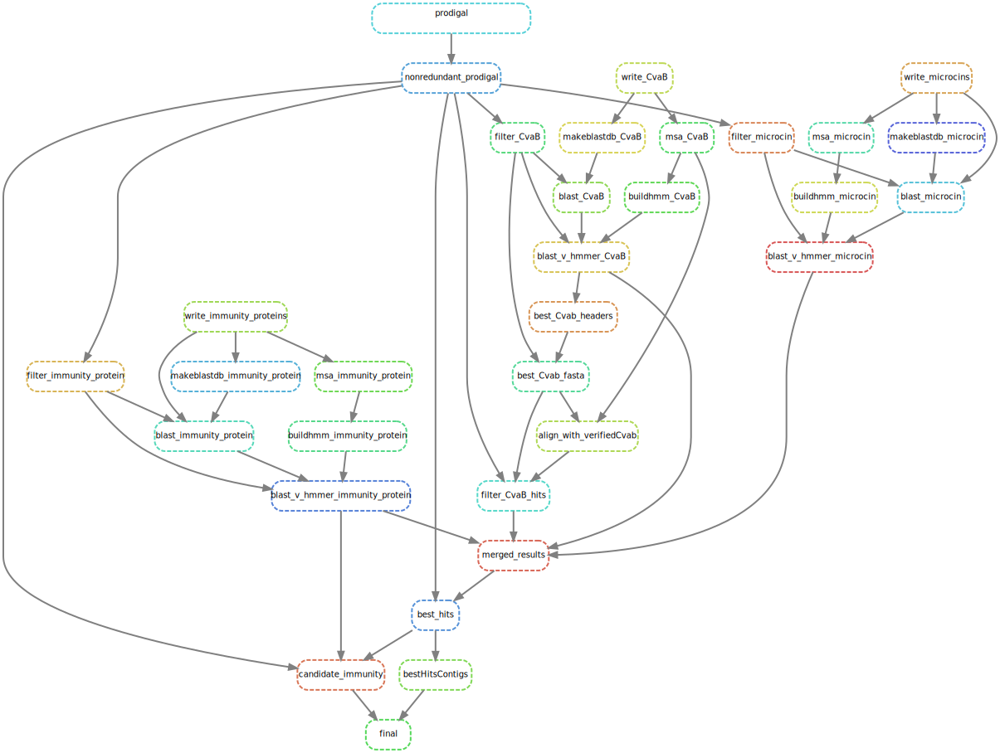

# cinful
A fully automated pipeline to identify microcins along with their associated immunity proteins and export machinery


# Installation

All software dependencies needed to run cinful are available through conda and are specified in `cinful_conda.yml`, the following helper script can be used to generate the cinful conda environment `scripts/build_conda_env.sh`, to run this script, you will need to have conda installed, as well as mamba (which helps speed up installation). To install mamba, use the following command:

```bash
conda install mamba -c conda-forge
```

Then simply run 
```bash
bash scripts/build_conda_env.sh
```

to set up the cinful environment. You can activate the environment with

```bash
conda activate cinful
```

# How to use

cinful takes a directory containing genome assemblies as input. All assemblies in the directory must end in `.fna`, if they end in a different extension, cinful will ignore them.

Snakemake is the core workflow management used by cinful, the main snakefile is located under `cinful/Snakefile`, which issues subroutines located in `cinful/rules`. To run cinful on your data set run the following command:

```bash
snakemake -d <assembly_directory> --threads <core_nums> --snakefile path/to/cinful/Snakefile
```

## Workflow

The following workflow will be executed.


Three output directories will be generated in your `assembly_directory` under a directory called `cinfulOut`.
* `00_dbs`
  * This is the initial location of the databases of verified microcins, CvaB, and immunity proteins.
* `01_orf_homology`
  * Prodigal will generate Open Reading Frame (ORF) predictions for the input assemblies
  * Those ORFs will be searched against the previously mentioned databases
* `02_homology_results`
  * The results from all the homology searches will be merged here
* `03_best_hits`
  * The top hits from the homology results will be placed here


<!-- ## Microcin homologs

* Filtering by length
   - Only need to search peptides that have < 150 AA
* Signal sequence
   - MSA of putative microcins can be used to evaluate the putative signal sequence based on what is known from the verifed dataset
 -->


<!-- ## Immunity protein homologs
* subcelluar localization and transmembrane helix will be predicted as a final filtering step
 -->

