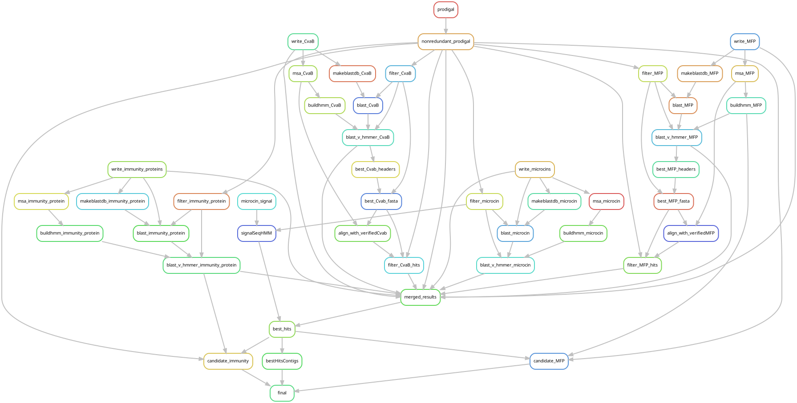

# *cinful*: an in-silico microcin identification pipeline
*cinful* reads a directory of genome data and identifies class II microcins using a combination of HMM and BLAST. It has functionality that identifies the associated export machinery (MFP & PCAT) and putative immunity protein. Publication of this work is forthcoming and will be cited here.

*cinful* is developed by the [Wilke lab](https://wilkelab.org/) at the [Department of Integrative Biology](https://integrativebio.utexas.edu/) in collaboration with the [Davies lab](https://bwdaviesutaustin.org/) at the [Department of Molecular Biosciences](https://molecularbiosci.utexas.edu/), both at [The University of Texas at Austin](https://www.utexas.edu/).

## Installation
There are two methods for installation; one uses pip and should be more user friendly.

## Installation from PyPI

The following includes steps to install dependencies.

### Setup conda environment (includes python and pip):
```bash
$ conda create --name <your-env-name> python=3.8.13 pip
$ conda activate <your-env-name>
```
### Install other dependencies:
```bash
$ conda activate <environment_name>
$ pip install cinful
$ conda install seqkit=0.15.0 mafft=7.475 hmmer=3.3.1 blast=2.9.0 diamond=2.0.11 pandas=1.2.4 numpy=1.24.4 biopython=1.76 snakemake=6.3.0 prodigal=2.6.3 pyhmmer=0.3.0
$ pip install pyTMHMM==1.3.2 seqhash==1.0.0 blake3==0.2.0
```

If installed properly, running `cinful -h` will produce the following output:

```
cinful

optional arguments:
  -h, --help            show this help message and exit
  -d DIRECTORY, --directory DIRECTORY
                        Must be a directory containing uncompressed FASTA 
                        formatted genome assemblies with .fna extension. 
                        Files within nested directories are fine
  -o OUTDIR, --outDir OUTDIR
                        This directory will contain all output files. 
                        It will be nested under the input directory.
  -t THREADS, --threads THREADS
                        This specifies how many threads to allow snakemake 
                        to have access to for parallelization
```


## Installation test

Run cinful on the cinful/test directory as such
$ cinful -d path/to/cinful/test -o <name_your_test>

## Usage notes

*cinful* takes a directory containing genome assemblies as input. All assemblies in the directory must contain the extension `.fna`. If they end in a different extension, they will be ignored. 

Nested directories will explored recursively, and all `\*.fna` files will be analyzed by *cinful*. Nested directories can be a good way to explore output, as the directory tree will be stored as a part of the *cinful_id* in the output files.

Snakemake is the core workflow management used by cinful -- the main snakefile is located under cinful/Snakefile, which issues subroutines located in cinful/rules.

*cinful* has been tested on Linux and MacOS.

## Workflow

With *cinful*, the following workflow will be executed.


Three output directories will be generated in your --directory <assembly_directory> under a directory called cinful_out (or an -outDir of your choosing):

**00_dbs**
* This is the initial location of the databases of verified microcins, CvaB, and immunity proteins.

**01_orf_homology**
* Prodigal will generate Open Reading Frame (ORF) predictions for the input assemblies
* Those ORFs will be searched against the previously mentioned databases

**02_homology_results**
* The results from all the homology searches will be merged here

**03_best_hits**
* The top hits from the homology results will be placed here

## Running from source (not recommended)

Clone this repository:

```bash
git clone https://github.com/wilkelab/cinful.git
```
All software dependencies needed to run *cinful* are available through conda and are specified in `cinful_conda.yml`, the following helper script can be used to generate the *cinful* conda environment `scripts/build_conda_env.sh`, to run this script, you will need to have conda installed, as well as mamba (which helps speed up installation). To install mamba, use the following command:

To build the environment, run:
```bash
bash env/build_conda_env.sh
```

Once setup is complete, you can activate the environment with:
```bash
conda activate cinful
```

There is a test dataset with an _E. coli_ genome assembly to test *cinful* on under `test/colcinV_Ecoli`, you can run *cinful* on this dataset by running the following from the initial *cinful* directory:
```bash
python path/to/cinful.py -d <genomes_directory> -o <output_directory> -t <threads>
```

# Contributing

*cinful* currently exists as a wrapper to a series of snakemake subroutines, so adding functionality to it is as simple as adding additional subroutines. If there are any subroutines that you see are needed, feel free to raise an issue, and I will be glad to guide you through the process of making a pull request to add that feature.

Additionally, since *cinful* primarily works through snakemake, it can also be used by simply running the snakefiles separately, so if additional configuration is needed, in terms of the types of input files, this can probably be achieved that way.
