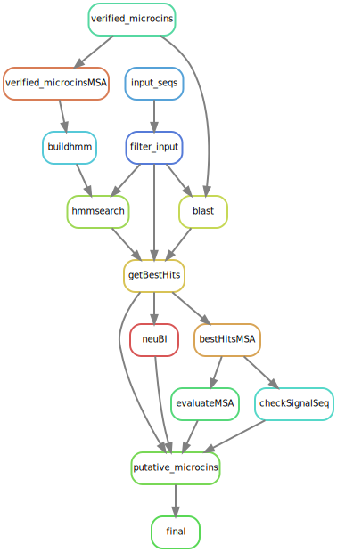

# cinful
A fully automated pipeline to identify microcins along with their associated immunity proteins and export machinery

# Subroutines

All subroutines contain the same basic homology search at the beginning, where an input query database of peptides are searched against a list of verified proteins.

1. BLAST
   - blastp database is constructed
   - various filters may be implemented (i.e. evalue, alignment coverage, percent match etc.)
2. HMMER
   - multiple sequence alignment of verified proteins is constructed
   - MSA is used to generate hidden markov model
   - HMM is searched against input query database
3. Get best hits
   - results from the two approaches are consolidated to retrieve hits with the highest likelihood of being homologous to the verified dataset

## Microcin homologs

* Filtering by length
   - Only need to search peptides that have < 150 AA
* Signal sequence
   - MSA of putative microcins can be used to evaluate the putative signal sequence based on what is known from the verifed dataset




## Immunity protein homologs
* subcelluar localization and transmembrane helix will be predicted as a final filtering step


## Export machinery

### CvaB


* Catalytic triad
  - putative homologs will be added to the verified MSA to see if the highly conserved catalyitic triad (C_32 H_105 D_121)

### CvaA

# Installing dependencies

Set up the conda environment from ```cinful_conda.yml``` using ```scripts/build_conda_env.sh``` or simply run the following command 

```bash
conda env create -f cinful_conda.yml
```